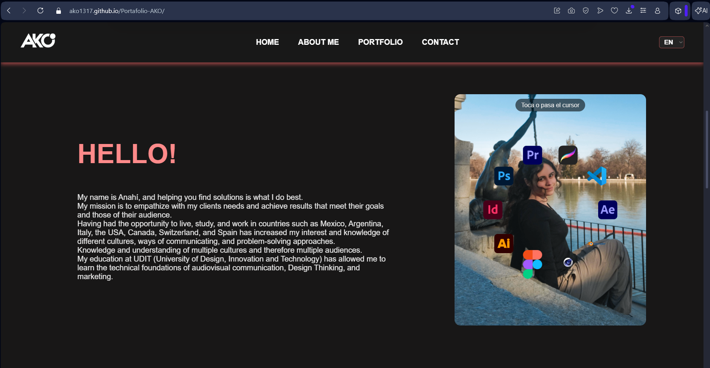
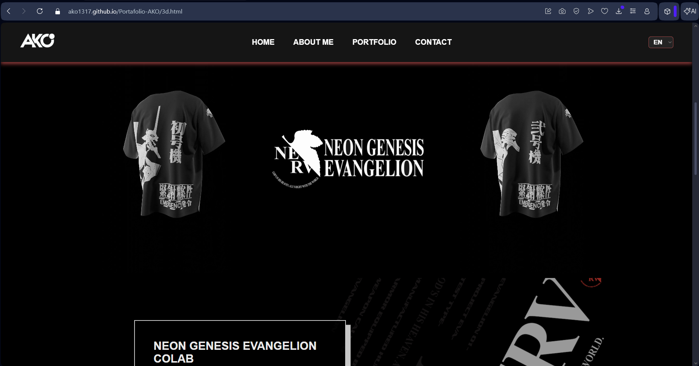

# 🌐 Portafolio AKO

🔗 **Despliegue en producción:**  
https://ako1317.github.io/Portafolio-AKO/

---

## 📌 Descripción y propósito del proyecto

Este proyecto corresponde a mi **portafolio web personal**, cuyo propósito es mostrar mi perfil profesional, habilidades técnicas y proyectos destacados de desarrollo frontend de manera clara, accesible y visualmente atractiva.

El portafolio sirve como:

- Carta de presentación profesional
- Showcase de proyectos reales
- Práctica de buenas prácticas de desarrollo, documentación y uso responsable de agentes de IA

---

## 🧰 Stack tecnológico

- **HTML5** — Estructura semántica
- **CSS3** — Diseño responsive y estilos
- **JavaScript (ES6+)** — Interactividad
- **Git & GitHub** — Control de versiones
- **GitHub Pages** — Despliegue

---

## ⚙️ Instrucciones de configuración para desarrollo local

1. Clona el repositorio:
   ```bash
   git clone https://github.com/ako1317/Portafolio-AKO.git
   ```

---

## 🎨 Guía de personalización

Si deseas adaptar este portafolio para otro perfil, puedes hacerlo fácilmente:

- **Información personal:**  
  Modifica los textos (nombre, descripción, enlaces) directamente en `index.html`.

- **Colores y estilos:**  
  Ajusta la paleta de colores, fuentes y tamaños desde los archivos CSS.

- **Proyectos:**  
  Añade, edita o elimina proyectos duplicando la estructura HTML existente en la sección de proyectos.

- **Imágenes:**  
  Sustituye las imágenes dentro de las carpetas de assets manteniendo las rutas o actualizándolas según sea necesario.

---

## 📸 Capturas de pantalla / Demo




---

## 🙌 Créditos y agradecimientos

- Diseño, contenido y desarrollo: **AKO**
- Inspiración: portfolios open source y referencias frontend
- Herramientas: GitHub, Visual Studio Code
- Asistentes de IA: utilizados como apoyo para comprender enfoques técnicos y planificar implementaciones

---

## 🤖 Política de uso de agentes de IA

En este proyecto se utilizaron asistentes de IA como **herramienta de apoyo técnico**, no como generadores directos de código final.

Las **ideas, estructura general y decisiones de diseño** fueron definidas por el autor.  
La IA se utilizó para:

- Comprender cómo implementar ciertas funcionalidades
- Explorar posibles enfoques técnicos
- Obtener planes paso a paso antes de escribir el código

### 🔄 Flujo de trabajo en dos fases

**Fase 1 — Planificación**

- Se consultó a la IA para obtener un plan o guía de implementación
- Dicho plan se documentó en archivos dentro de la carpeta `docs/`

**Fase 2 y 3 — Implementación**

- El código fue escrito y adaptado manualmente
- Se siguió el plan documentado como referencia, realizando ajustes cuando fue necesario

No se implementó ninguna funcionalidad sin una fase previa de planificación documentada.

---

## 📄 Licencia

Este proyecto está protegido bajo la **CC BY-NC-SA 4.0**.  
Consulta el archivo [`LICENSE`](./LICENSE) para más información.
